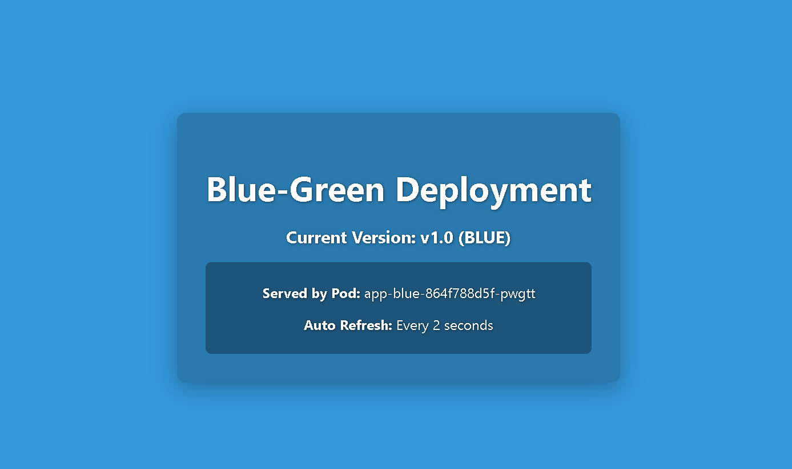
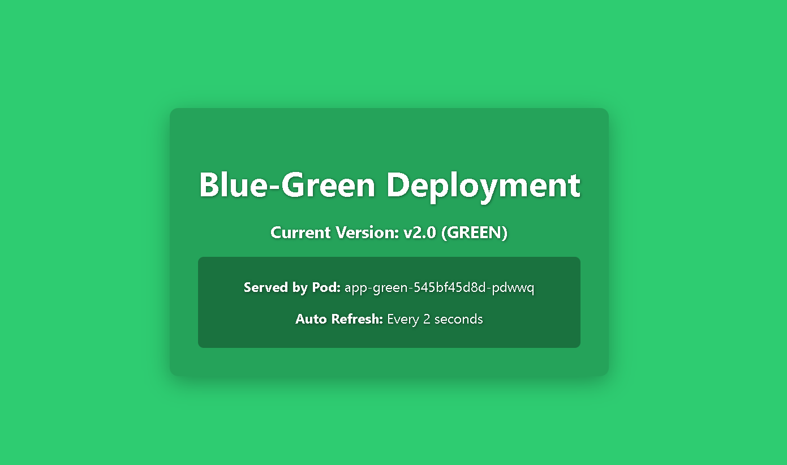

# Cloud-Native Blue-Green Deployment Sandbox

> **A production-realistic, user-friendly DevOps learning environment** for practicing and demonstrating zero-downtime application deployments and risk-free rollbacks. This project provides a sandbox containing a complete containerized web application, deployment scripts, infrastructure configurations, and automated pipeline files.

---

## 📋 Table of Contents

1. [About the Project](#about-the-project)
2. [Sandbox Structure](#sandbox-structure)
3. [Prerequisites](#prerequisites)
4. [Installation Instructions](#installation-instructions)
5. [Usage Guide](#usage-guide)
   - [1. Accessing the Application](#1-accessing-the-application)
   - [2. Switching Traffic to Green](#2-switching-traffic-to-green)
   - [3. Rolling Back Traffic to Blue](#3-rolling-back-traffic-to-blue)
6. [Contributing](#contributing)
7. [License](#license)
8. [Contact Information](#contact-information)
9. [Related Documentation](#related-documentation)

---

## 🔍 About the Project

### What is a Blue-Green Deployment?
Imagine a theater with two identical stages: **Stage Blue** and **Stage Green**.
* **Stage Blue (Active):** This stage is lit up. The audience is watching the current show (Version 1.0 of our application).
* **Stage Green (Idle):** This stage is dark. The crew is setting up a new show (Version 2.0 of our application) and testing everything in private without the audience noticing.

Once the new show is ready, the theater operator flips a switch. The lights on **Stage Blue** go dark, and the lights on **Stage Green** instantly turn on. The audience now watches the new show with zero delay or interruption (zero downtime).

If something goes wrong with the new show, the operator simply flips the switch back. The audience is redirected back to the stable **Stage Blue** instantly (instant rollback).

This sandbox is a playground designed to teach and demonstrate this technique using standard DevOps tools like **Docker** (for packaging), **Kubernetes** (for stage management), **Terraform** (for building cloud stages in AWS), and **Jenkins/GitHub Actions** (for automation).

#### Zero-Downtime Sandbox Output:

<table>
  <tr>
    <td align="center"><b>Blue Version (Active)</b><br></td>
    <td align="center"><b>Green Version (Idle)</b><br></td>
  </tr>
</table>

---

## 📁 Sandbox Structure

Here is a directory map of how the files in this project are organized:

```
├── docs/                        # Complete project documentation guides
│   ├── assets/                  # Images and screenshots of the deployment output
│   ├── Local-Guide.md           # Step-by-step local cluster setup guide
│   ├── AWS-Guide.md             # AWS/EKS infrastructure guide
│   └── CICD-Guide.md            # GitHub Actions & Jenkins pipeline guide
│
├── app/                         # Code for the Node.js demo web application
│   ├── Dockerfile               # Instructions for packaging the web application
│   └── server.js                # Core code for the web server
│
├── k8s/                         # Kubernetes configuration files
│   ├── blue-deployment.yaml     # Configuration for the Blue (v1.0) application
│   ├── green-deployment.yaml    # Configuration for the Green (v2.0) application
│   ├── service.yaml             # Router that directs user traffic
│   └── kind-config.yaml         # Config for setting up a local Kind cluster
│
├── scripts/                     # Operational automation scripts
│   ├── deploy-local.sh          # Builds local images and sets up deployments
│   ├── deploy-aws.sh            # Packages and deploys applications on AWS
│   └── switch-traffic.sh        # Automates the traffic switch between Blue and Green
│
├── terraform/                   # AWS cloud infrastructure blueprints
│   ├── bootstrap-backend/       # Prepares safe remote storage for AWS state
│   └── *.tf                     # VPC, ECR registries, and EKS cluster configurations
│
├── .github/workflows/           # GitHub Actions automated workflows
│   ├── ci.yml                   # Automated tests, linting, and safety checks
│   ├── blue-green-cd.yml        # Workflow to manually switch traffic on AWS
│   └── terraform-provision.yml  # Workflow to provision or destroy AWS environments
│
└── jenkins/                     # Jenkins Pipeline configurations
    ├── local.Jenkinsfile        # Pipeline for local deployment and testing
    └── aws.Jenkinsfile          # Pipeline for deploying to AWS EKS
```

---

## 🛠️ Prerequisites

Before you get started, ensure you have the following software installed on your machine:

* **[Docker Desktop](https://www.docker.com/products/docker-desktop/)**: Used to create, run, and manage isolated software containers. Make sure Docker is running on your machine.
* **[kubectl](https://kubernetes.io/docs/tasks/tools/)**: A command-line tool that lets you talk to and control Kubernetes clusters.
* **[Kind](https://kind.sigs.k8s.io/)** (Recommended) or **[Minikube](https://minikube.sigs.k8s.io/)**: Tools that create a miniature Kubernetes cluster on your local computer.
* **A Terminal Shell**: Git Bash or WSL (Windows Subsystem for Linux) if you are on Windows, or the terminal if you are on macOS or Linux.

---

## 📥 Installation Instructions

Follow these step-by-step instructions to get the sandbox running locally on your computer:

### Step 1: Clone the Repository
Open your terminal and run the following command to download this project to your computer:
```bash
git clone https://github.com/Sanket006/Cloud-Native-Blue-Green-Deployment-Pipeline.git
cd Cloud-Native-Blue-Green-Deployment-Pipeline
```

### Step 2: Configure Script Permissions
Give your terminal permission to run the included helper scripts:
```bash
chmod +x scripts/deploy-local.sh scripts/switch-traffic.sh
```

### Step 3: Start a Local Cluster
Choose one of the options below to create a local Kubernetes cluster:
* **Option A: Using Kind (Recommended)**
  Kind stands for "Kubernetes in Docker". Run this command to spin up a pre-configured cluster that maps port `30080` for easy browser access:
  ```bash
  kind create cluster --name mycluster --config k8s/kind-config.yaml
  ```
* **Option B: Using Minikube**
  If you prefer Minikube, run:
  ```bash
  minikube start
  ```

### Step 4: Run the Deployment Script
Deploy the Blue (v1) and Green (v2) environments to your local cluster by running:
```bash
./scripts/deploy-local.sh
```
This script will build the Node.js application containers, load them into your Kubernetes cluster, launch the separate Blue and Green pod groups, and set up the network routing service.

---

## 🚀 Usage Guide

After setting up the sandbox, you can manually interact with the environment, switch traffic, and perform rollbacks.

### 1. Accessing the Application
To see the application in action:
* **If you are using Kind:**
  Open your web browser and navigate to: **[http://localhost:30080](http://localhost:30080)**
* **If you are using Minikube or other environments:**
  Open a new terminal window and set up a connection bridge (port-forwarding):
  ```bash
  kubectl port-forward service/bg-demo-service 8080:80
  ```
  Then, open your web browser and navigate to: **[http://localhost:8080](http://localhost:8080)**

*You should see a blue web page with the text `v1.0 (BLUE)` displayed. The page auto-refreshes every 2 seconds to show incoming requests.*

### 2. Switching Traffic to Green
To switch the routing selector so that 100% of user traffic is instantly sent to the Green environment (Version 2.0) with zero downtime, run:
```bash
./scripts/switch-traffic.sh green
```
Go back to your web browser. You will see the page background color dynamically transition to green and display `v2.0 (GREEN)` serving your requests.

### 3. Rolling Back Traffic to Blue
If you find a bug in the Green version and need to immediately revert to the stable Blue version, run:
```bash
./scripts/switch-traffic.sh blue
```
The traffic selector will update instantly, and your browser will show the stable `v1.0 (BLUE)` page again.

---

## 🤝 Contributing

We welcome contributions to help improve this learning sandbox! To participate, please follow these steps:

1. **Fork the Repository:** Create your own copy of this repository on GitHub.
2. **Create a Feature Branch:** Create a branch for your changes:
   ```bash
   git checkout -b feature/your-awesome-feature
   ```
3. **Commit Your Changes:** Write clear, concise commit messages explaining your updates:
   ```bash
   git commit -m "Add simple deployment script for Helm charts"
   ```
4. **Push the Branch:** Push your branch up to your GitHub fork:
   ```bash
   git push origin feature/your-awesome-feature
   ```
5. **Open a Pull Request:** Go to the original repository on GitHub, click **New Pull Request**, select your branch, and explain your changes.

---

## 📄 License

This project is licensed under the terms of the **MIT License**. This means you are free to download, modify, use, and share this code for personal or commercial projects. See the [LICENSE](LICENSE) file for the full text.

---

## 📧 Contact Information

If you have questions, feedback, or need help setting up the sandbox:
* **Project Maintainer:** Sanket
* **Support Channel:** If you run into issues, please open a ticket on the [GitHub Issues Page](https://github.com/Sanket006/Cloud-Native-Blue-Green-Deployment-Pipeline/issues).

---

## 📚 Related Documentation

| Document | Type | Priority | Description |
| :--- | :--- | :--- | :--- |
| 📄 **[README.md](README.md)** | Repository Landing | **Critical** | Root project overview, architecture blueprint, and navigation index. |
| 📄 **[Local-Guide.md](docs/Local-Guide.md)** | Local Sandbox | **High** | Walkthrough for starting a local cluster (Kind/Minikube) and running local deployments. |
| 📄 **[AWS-Guide.md](docs/AWS-Guide.md)** | Infrastructure | **High** | Step-by-step instructions for provisioning EKS/ECR/VPC via Terraform. |
| 📄 **[CICD-Guide.md](docs/CICD-Guide.md)** | CI/CD Reference | **High** | Detailed setups, YAML/Jenkinsfile configuration, and troubleshooting for GitHub Actions & Jenkins. |
